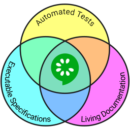

This project was made under the following specifications:

*Programming language java with package (JDK 1.8.0.92) -> package not included in this directory
*Cucumber framework 1.2.4
*Selenium java 2.53 
*Eclipse Java EE IDE for Web Developers. Version: Mars.2 Release (4.5.2)

Note: It's also included junit jar file, user is able to run project as JUnit test.

Frameworks description:
------

*Selenium is an umbrella project encapsulating a variety of tools and libraries enabling web browser automation. Selenium specifically provides infrastructure for the W3C WebDriver specification — a platform and language-neutral coding interface compatible with all major web browsers.
 
 Selenium webdriver  reference page: http://docs.seleniumhq.org/projects/webdriver/
 
 

*Cucumber is a tool that supports Behaviour-Driven Development (BDD) - a software development process that aims to enhance software quality and reduce maintenance costs.

Cucumber executes executable specifications written in plain language and produces reports indicating whether the software behaves according to the specification or not.

Cucumber reduces the effort to keep requirements specifications, tests and documentation in sync - with Cucumber they are all the same documents - a single source of truth for everyone on the team.

Cucumber reference page: https://cucumber.io/

    

